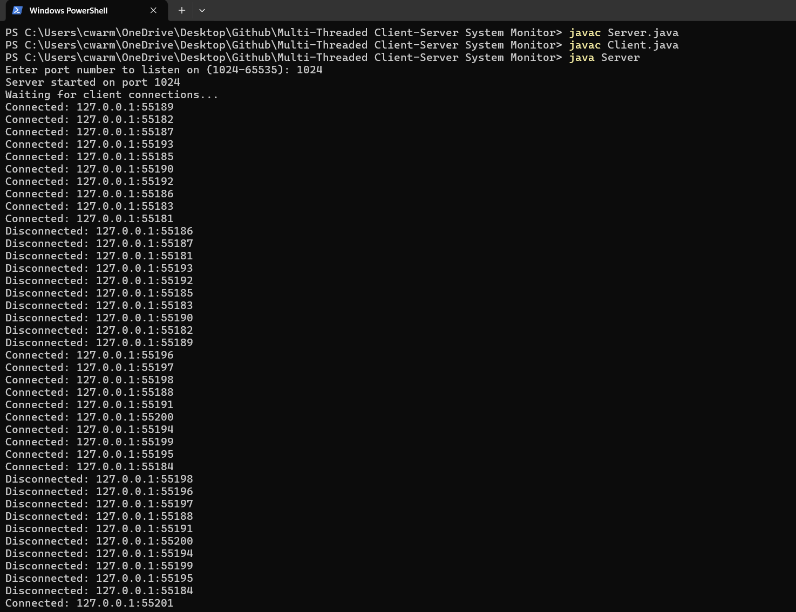
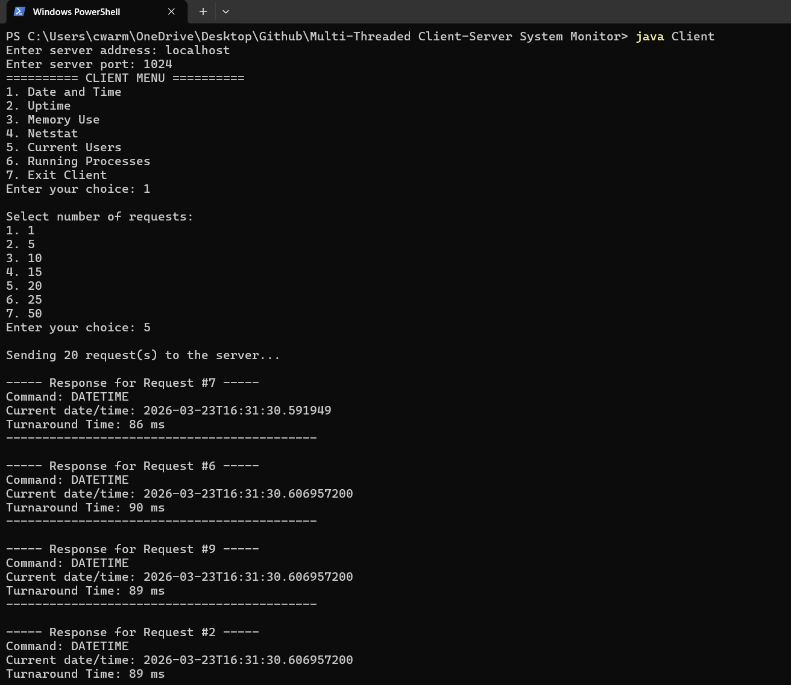
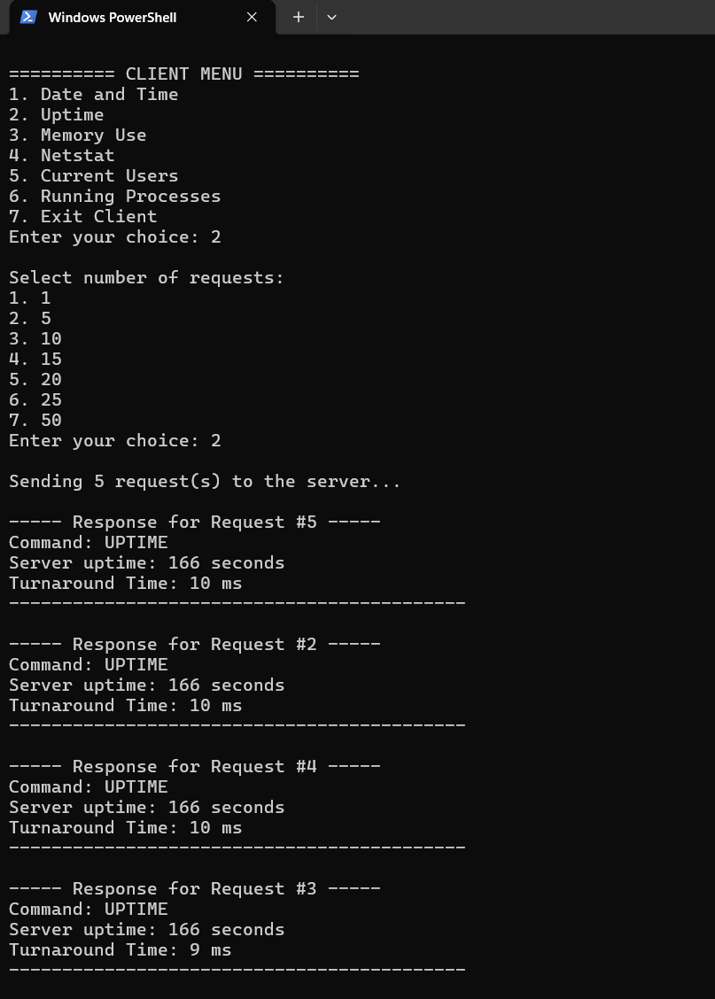

# Multi-Threaded Client-Server System Monitor

## Overview
A Java-based client-server application that executes system commands remotely and measures performance using concurrent requests.

## Features
- Socket-based communication
- Multi-threaded server
- Thread pool for concurrent requests
- Remote system command execution
- Performance measurement (turnaround time)

## Technologies Used
- Java
- Sockets
- Multithreading
- ExecutorService

## How to Run

Compile:
javac Server.java  
javac Client.java  

Run Server:
java Server  

Run Client:
java Client  

## Screenshots

### Server Running

### Client - Date and Time

### Client - Uptime

## Author
Connor Warming
